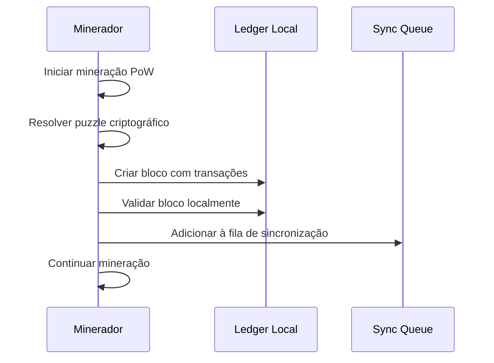
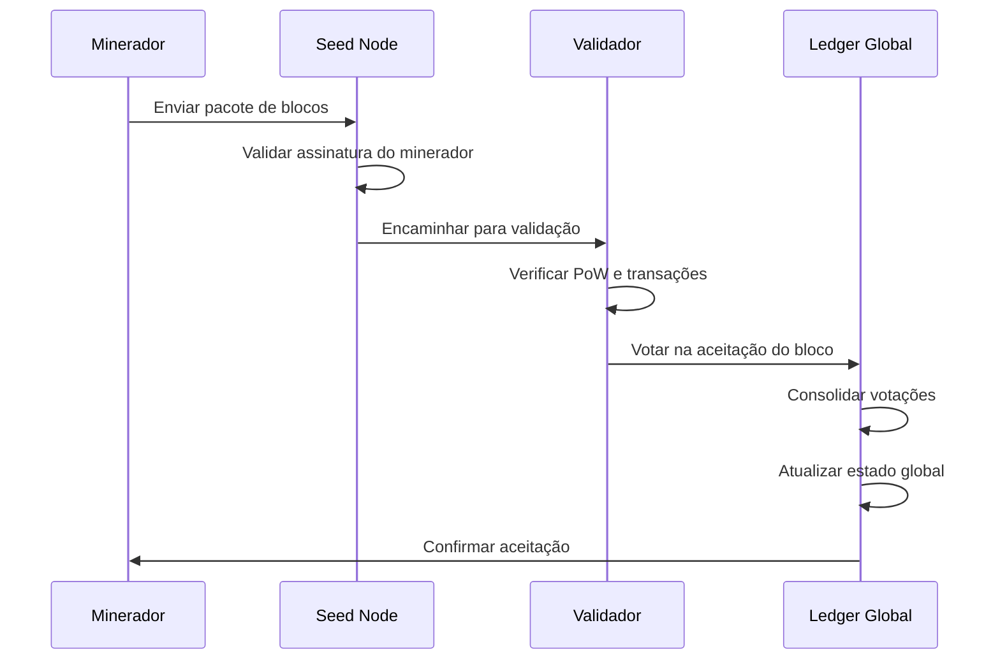
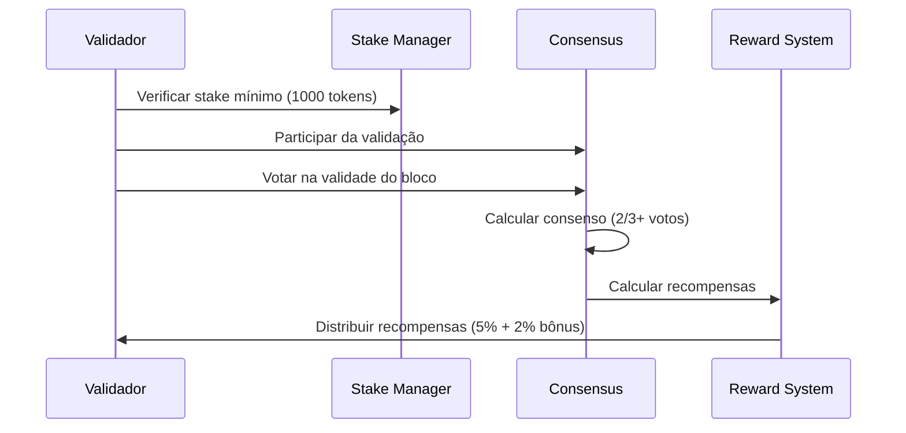

# 🏗️ Arquitetura Consolidada ORDM Blockchain 2-Layer

## 📋 Visão Geral

Esta é a **arquitetura única e consolidada** do sistema ORDM, implementando uma blockchain 2-layer híbrida com separação clara entre mineração offline (PoW) e validação online (PoS). O sistema foi projetado para ser escalável, seguro e fácil de usar.

---

## 🎯 **Arquitetura Principal**

### **Fluxo de Dados Principal**
```
┌─────────────────┐    ┌─────────────────┐    ┌─────────────────┐    ┌─────────────────┐
│   Minerador     │    │   Seed Nodes    │    │   Validadores   │    │   Ledger        │
│   Offline       │───▶│   Online        │───▶│   PoS           │───▶│   Global        │
│   (PoW)         │    │   (P2P)         │    │   (Stake)       │    │   (Database)    │
└─────────────────┘    └─────────────────┘    └─────────────────┘    └─────────────────┘
         │                       │                       │                       │
         ▼                       ▼                       ▼                       ▼
   ┌─────────────┐       ┌─────────────┐       ┌─────────────┐       ┌─────────────┐
   │ Blocos      │       │ Pacotes     │       │ Votações    │       │ Estado      │
   │ Minerados   │       │ Assinados   │       │ Consenso    │       │ Global      │
   └─────────────┘       └─────────────┘       └─────────────┘       └─────────────┘
```

### **Componentes da Arquitetura**

#### **1. Camada Offline (Mineradores)**
- **Função**: Mineração PoW independente
- **Storage**: Local criptografado (BadgerDB)
- **Interface**: Dashboard de mineração
- **Sincronização**: Envio assíncrono de blocos
- **Autenticação**: MinerID único por máquina

#### **2. Camada Online (Seed Nodes)**
- **Função**: Descoberta de peers e roteamento
- **Storage**: Cache de metadados
- **Interface**: Status de rede
- **Comunicação**: P2P com libp2p

#### **3. Camada de Validação (Validadores)**
- **Função**: Consenso PoS e validação
- **Storage**: Estado de stake e votações
- **Interface**: Dashboard de validação
- **Recompensas**: APY base + bônus validator

#### **4. Camada de Ledger (Database Global)**
- **Função**: Estado global imutável
- **Storage**: Persistente e replicado
- **Interface**: Explorer público
- **API**: REST para integração

---

## 🔄 **Fluxo Detalhado de Operações**

### **1. Mineração Offline (PoW)**


### **2. Sincronização com Rede Online**


### **3. Validação PoS**


---

## 🏗️ **Estrutura de Componentes**

### **Executáveis Principais**
```
cmd/
├── offline_miner/     # Minerador PoW offline
├── gui/              # Interface principal (múltiplos modos)
├── explorer/         # Blockchain explorer público
├── backend/          # Servidor backend global
├── monitor/          # Sistema de monitoramento
└── node/             # Node básico da rede
```

### **Pacotes Core**
```
pkg/
├── blockchain/       # Estrutura de blocos e DAG
├── consensus/        # Consenso híbrido PoW/PoS
├── crypto/           # Criptografia e segurança
├── wallet/           # Gerenciamento de wallets
├── auth/             # Autenticação 2FA
├── storage/          # Persistência (offline/online)
├── network/          # Rede P2P e seed nodes
├── p2p/              # Comunicação libp2p
├── economics/        # Tokenomics e recompensas
├── api/              # API REST pública
└── logger/           # Sistema de logs estruturados
```

---

## 🔐 **Sistema de Segurança**

### **Autenticação 2FA**
```
┌─────────────┐    ┌─────────────┐    ┌─────────────┐
│   Wallet    │───▶│   PIN 2FA   │───▶│   Session   │
│   Login     │    │   (60s)     │    │   Token     │
└─────────────┘    └─────────────┘    └─────────────┘
```

### **Proteção de Chaves**
```
┌─────────────┐    ┌─────────────┐    ┌─────────────┐
│ Private Key │───▶│ AES-256     │───▶│ Keystore    │
│ Generation  │    │ Encryption  │    │ Encrypted   │
└─────────────┘    └─────────────┘    └─────────────┘
```

### **Auditoria Completa**
```
┌─────────────┐    ┌─────────────┐    ┌─────────────┐
│   Action    │───▶│   Audit     │───▶│   Log       │
│   Performed │    │   Log       │    │   Storage   │
└─────────────┘    └─────────────┘    └─────────────┘
```

---

## 💰 **Sistema Econômico**

### **Tokenomics**
- **Supply Máximo**: 21M tokens (como Bitcoin)
- **Recompensa Inicial**: 50 tokens por bloco
- **Halving**: A cada 210k blocos
- **Queima**: 10% das taxas de transação
- **Stake APY**: 5% base + 2% bônus validator

### **Fluxo de Recompensas**
```
┌─────────────┐    ┌─────────────┐    ┌─────────────┐
│   Mining    │───▶│   Block     │───▶│   Reward    │
│   PoW       │    │   Reward    │    │   (50)      │
└─────────────┘    └─────────────┘    └─────────────┘
         │                       │                       │
         ▼                       ▼                       ▼
┌─────────────┐    ┌─────────────┐    ┌─────────────┐
│   Stake     │───▶│   APY       │───▶│   Reward    │
│   PoS       │    │   (5%+2%)   │    │   (Anual)   │
└─────────────┘    └─────────────┘    └─────────────┘
```

---

## 🌐 **Interfaces de Usuário**

### **Interface de Minerador**
```
┌─────────────────────────────────────────────────────────┐
│                    MINERADOR OFFLINE                    │
├─────────────────────────────────────────────────────────┤
│  Status: ⛏️ Mineração Ativa                             │
│  Blocos Minerados: 1,234                                │
│  Hash Rate: 338 H/s                                     │
│  Pacotes Pendentes: 5                                   │
│                                                         │
│  [Iniciar Mineração] [Parar] [Sincronizar]             │
│                                                         │
│  ┌─────────────────┐  ┌─────────────────┐              │
│  │ Últimos Blocos  │  │ Configurações   │              │
│  │ • Bloco #1234   │  │ • Dificuldade   │              │
│  │ • Bloco #1233   │  │ • Energia       │              │
│  │ • Bloco #1232   │  │ • Sincronização │              │
│  └─────────────────┘  └─────────────────┘              │
└─────────────────────────────────────────────────────────┘
```

### **Interface de Validador**
```
┌─────────────────────────────────────────────────────────┐
│                   VALIDADOR ONLINE                      │
├─────────────────────────────────────────────────────────┤
│  Status: ✅ Ativo                                       │
│  Stake: 9,000 tokens                                   │
│  APY: 7% (5% + 2% bônus)                              │
│  Blocos Validados: 567                                 │
│                                                         │
│  [Adicionar Stake] [Remover Stake] [Ver Recompensas]   │
│                                                         │
│  ┌─────────────────┐  ┌─────────────────┐              │
│  │ Blocos Recebidos│  │ Votações        │              │
│  │ • Bloco #1234   │  │ • Aceito: 95%   │              │
│  │ • Bloco #1233   │  │ • Rejeitado: 5% │              │
│  │ • Bloco #1232   │  │ • Pendente: 0   │              │
│  └─────────────────┘  └─────────────────┘              │
└─────────────────────────────────────────────────────────┘
```

### **Interface de Usuário**
```
┌─────────────────────────────────────────────────────────┐
│                    USUÁRIO FINAL                        │
├─────────────────────────────────────────────────────────┤
│  Wallet: 0e3e39bb44817687a4476fbb58e3ad08              │
│  Saldo: 1,250 tokens                                   │
│  Stake: 500 tokens                                     │
│                                                         │
│  [Enviar] [Receber] [Stake] [Explorer]                 │
│                                                         │
│  ┌─────────────────┐  ┌─────────────────┐              │
│  │ Transações      │  │ Explorer        │              │
│  │ • +50 (mining)  │  │ • Blocos: 1,234 │              │
│  │ • -25 (send)    │  │ • Supply: 33.9k │              │
│  │ • +10 (stake)   │  │ • Validators: 5 │              │
│  └─────────────────┘  └─────────────────┘              │
└─────────────────────────────────────────────────────────┘
```

---

## 📡 **Protocolos de Comunicação**

### **P2P Network (libp2p)**
```
┌─────────────┐    ┌─────────────┐    ┌─────────────┐
│   Peer A    │◄──►│   Peer B    │◄──►│   Peer C    │
│   (Miner)   │    │ (Validator) │    │ (Explorer)  │
└─────────────┘    └─────────────┘    └─────────────┘
         ▲                       ▲                       ▲
         │                       │                       │
         ▼                       ▼                       ▼
┌─────────────┐    ┌─────────────┐    ┌─────────────┐
│   Seed      │    │   Seed      │    │   Seed      │
│   Node 1    │    │   Node 2    │    │   Node 3    │
└─────────────┘    └─────────────┘    └─────────────┘
```

### **API REST**
```
┌─────────────┐    ┌─────────────┐    ┌─────────────┐
│   Client    │───▶│   API       │───▶│   Backend   │
│   (Web)     │    │   Gateway   │    │   (Go)      │
└─────────────┘    └─────────────┘    └─────────────┘
         │                       │                       │
         ▼                       ▼                       ▼
   ┌─────────┐             ┌─────────┐             ┌─────────┐
   │ GET     │             │ POST    │             │ PUT     │
   │ /blocks │             │ /sync   │             │ /stake  │
   └─────────┘             └─────────┘             └─────────┘
```

---

## 🔧 **Configuração e Deploy**

### **Variáveis de Ambiente**
```bash
# Configuração de Rede
NETWORK_TYPE=testnet
SEED_NODES=["node1.ordm.com","node2.ordm.com"]
P2P_PORT=3001

# Configuração de Storage
DATA_DIR=/opt/render/data
BACKUP_DIR=/opt/render/backup
ENCRYPTION_KEY=your-secret-key

# Configuração de Segurança
JWT_SECRET=your-jwt-secret
RATE_LIMIT=100
SESSION_TIMEOUT=3600

# Configuração de Mineração
MINING_DIFFICULTY=2
MINING_REWARD=50
STAKE_MINIMUM=1000
```

### **Docker Compose**
```yaml
version: '3.8'
services:
  ordm-backend:
    build: .
    ports:
      - "3000:3000"
    environment:
      - NETWORK_TYPE=testnet
    volumes:
      - ordm-data:/opt/render/data
      
  ordm-explorer:
    build: .
    ports:
      - "8080:8080"
    depends_on:
      - ordm-backend
      
  ordm-seed:
    build: .
    ports:
      - "3001:3001"
    environment:
      - SEED_NODE=true

volumes:
  ordm-data:
```

---

## 📊 **Métricas e Monitoramento**

### **Métricas de Rede**
- **Active Peers**: Número de peers conectados
- **Block Height**: Altura atual da blockchain
- **Transaction Rate**: Transações por segundo
- **Sync Status**: Status de sincronização

### **Métricas de Mineração**
- **Hash Rate**: Hashes por segundo
- **Blocks Mined**: Blocos minerados
- **Energy Cost**: Custo de energia
- **Profitability**: Lucratividade

### **Métricas de Validação**
- **Stake Amount**: Total em stake
- **Validator Count**: Número de validadores
- **Consensus Rate**: Taxa de consenso
- **Reward Distribution**: Distribuição de recompensas

---

## 🚀 **Roadmap de Implementação**

### **Fase 1: Fundação (Semanas 1-2)**
- [x] Consolidação arquitetural
- [x] Documentação unificada
- [x] Separação de responsabilidades

### **Fase 2: Segurança (Semanas 3-4)**
- [ ] Autenticação 2FA melhorada
- [ ] Proteção de chaves
- [ ] Auditoria completa

### **Fase 3: Persistência (Semanas 5-6)**
- [ ] Storage offline criptografado
- [ ] Sincronização assíncrona
- [ ] Backup automático

### **Fase 4: Testes (Semanas 7-8)**
- [ ] Testes unitários
- [ ] Testes de integração
- [ ] Testes de segurança

### **Fase 5: Otimização (Semanas 9-10)**
- [ ] Redução de dependências
- [ ] Otimização de performance
- [ ] Monitoramento avançado

### **Fase 6: Deploy (Semanas 11-12)**
- [ ] Deploy em produção
- [ ] Validação final
- [ ] Monitoramento contínuo

---

## 🎯 **Decisões Arquiteturais**

### **1. Separação Offline/Online**
- **Decisão**: Mineração offline, validação online
- **Justificativa**: Permite mineração sem dependência de rede
- **Benefícios**: Escalabilidade, independência, eficiência

### **2. Consenso Híbrido PoW/PoS**
- **Decisão**: PoW para mineração, PoS para validação
- **Justificativa**: Combina segurança do PoW com eficiência do PoS
- **Benefícios**: Segurança, eficiência, descentralização

### **3. Storage Local Criptografado**
- **Decisão**: BadgerDB local com criptografia
- **Justificativa**: Performance e segurança para dados sensíveis
- **Benefícios**: Velocidade, segurança, privacidade

### **4. Autenticação 2FA**
- **Decisão**: PIN único por wallet com validade temporal
- **Justificativa**: Segurança sem complexidade excessiva
- **Benefícios**: Segurança, usabilidade, controle

---

**🎯 Esta arquitetura consolidada fornece uma base sólida e escalável para o desenvolvimento futuro do ORDM Blockchain 2-Layer.**

