# 🔄 Diagrama de Fluxo ORDM Blockchain

## 📋 Visão Geral

Este documento apresenta os **diagramas de fluxo consolidados** do sistema ORDM Blockchain 2-Layer, mostrando o fluxo de dados e operações principais.

---

## 🏗️ **Fluxo Principal do Sistema**

### **Arquitetura 2-Layer**
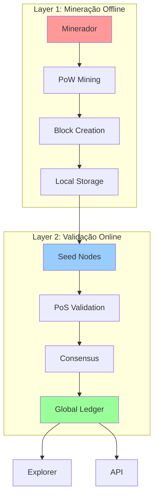

---

## 🔐 **Fluxo de Autenticação**

### **Processo de Login 2FA**
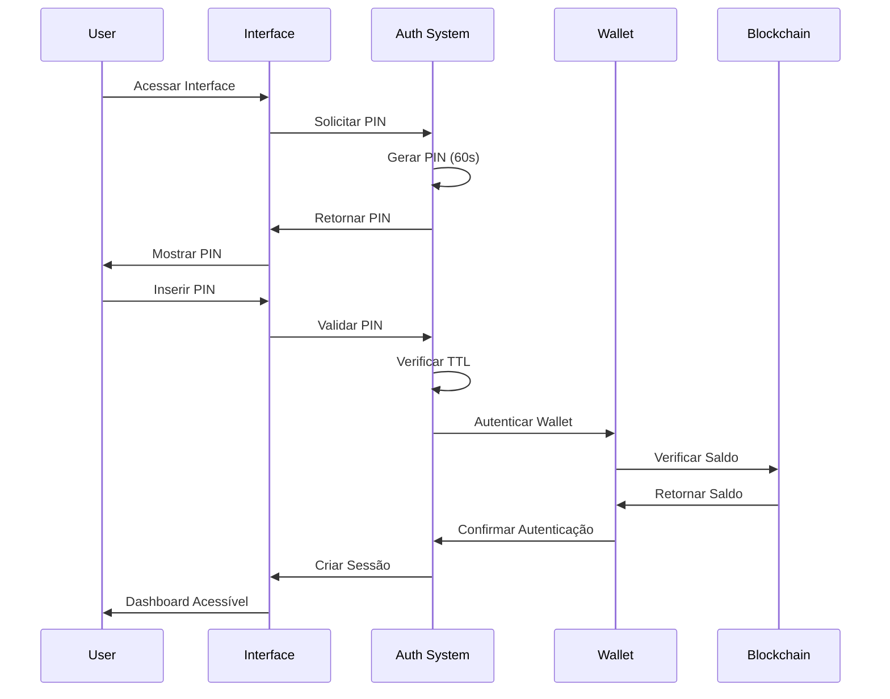

---

## ⛏️ **Fluxo de Mineração**

### **Processo de Mineração PoW**
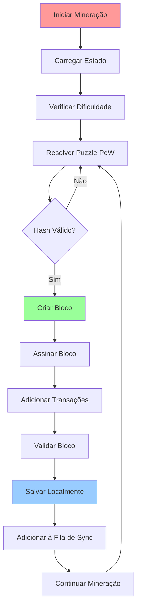

---

## 🔄 **Fluxo de Sincronização**

### **Offline para Online**
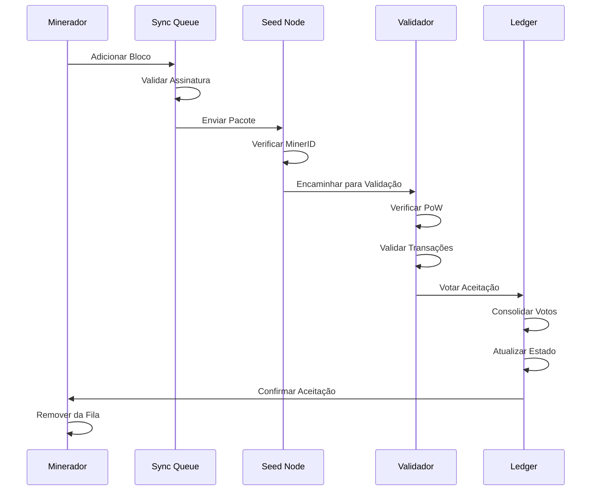

---

## 💰 **Fluxo de Transações**

### **Processo de Transferência**
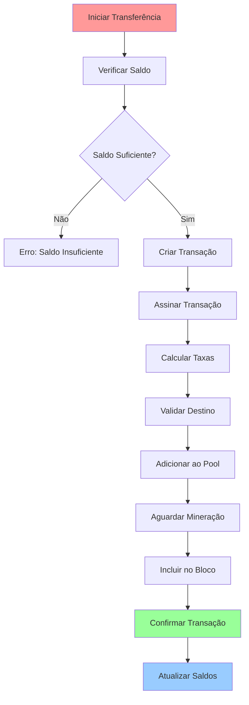

---

## 🏆 **Fluxo de Validação PoS**

### **Processo de Stake e Validação**
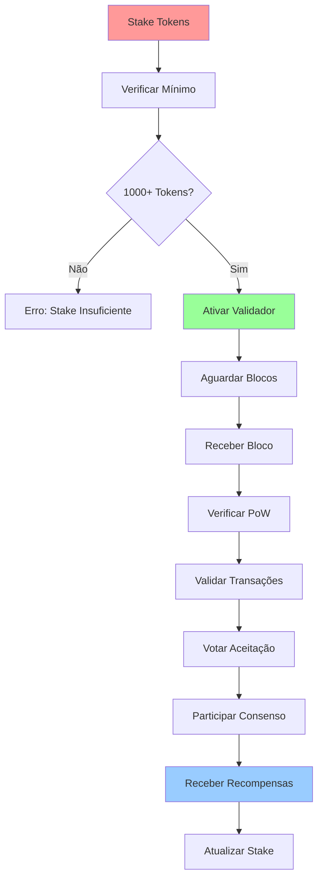

---

## 🔐 **Fluxo de Segurança**

### **Proteção de Chaves**
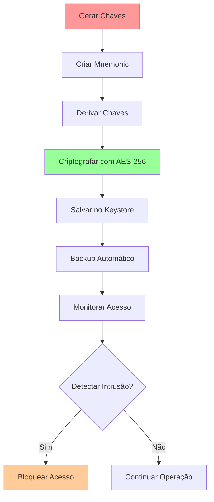

---

## 📊 **Fluxo de Monitoramento**

### **Coleta de Métricas**
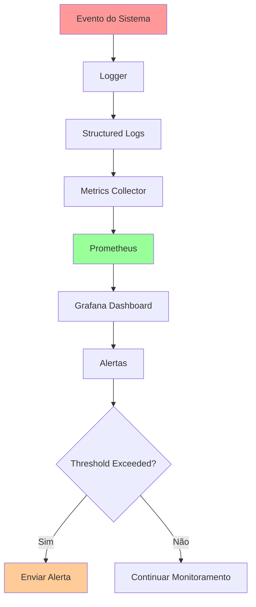

---

## 🌐 **Fluxo de Rede P2P**

### **Descoberta de Peers**
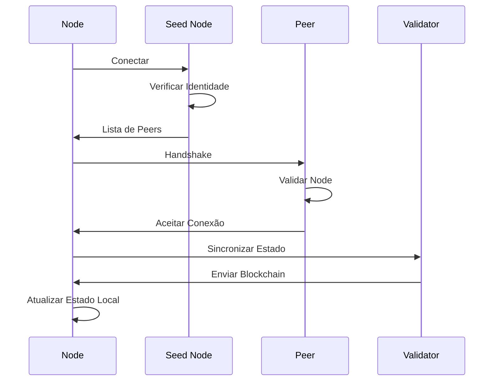

---

## 💾 **Fluxo de Storage**

### **Persistência de Dados**
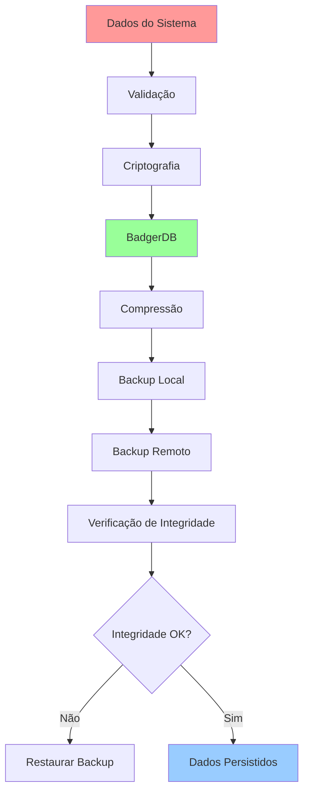

---

## 🔄 **Fluxo de Recuperação**

### **Processo de Failover**
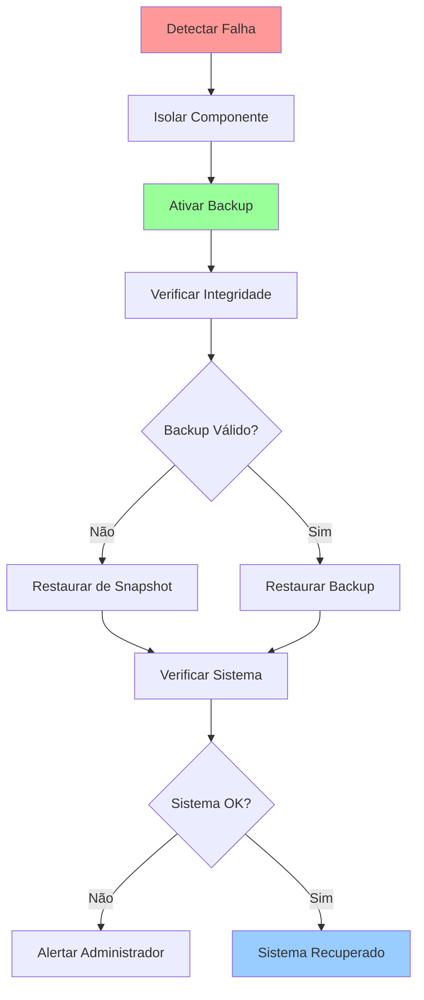

---

## 📈 **Fluxo de Performance**

### **Otimização de Recursos**
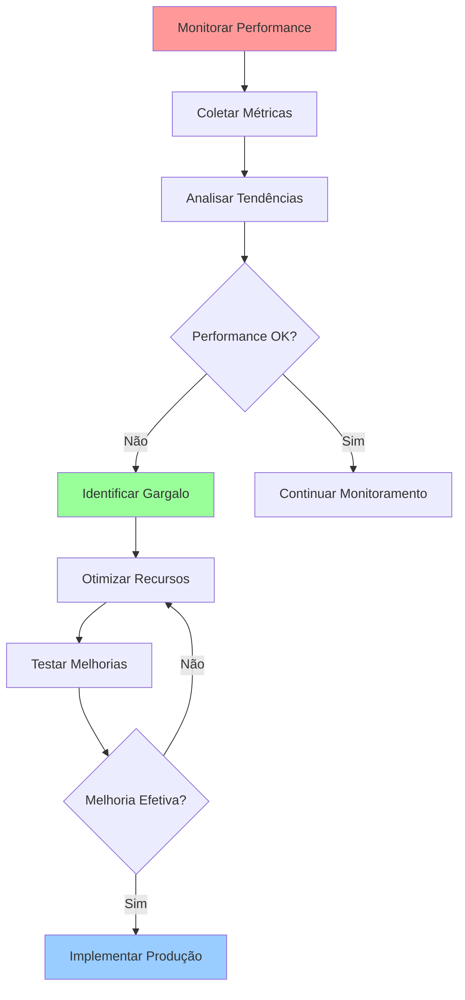

---

## 🎯 **Resumo dos Fluxos**

### **Fluxos Principais**
1. **Autenticação**: Login 2FA com PIN temporal
2. **Mineração**: PoW offline com sincronização
3. **Validação**: PoS online com stake
4. **Transações**: Transferências P2P seguras
5. **Storage**: Persistência criptografada
6. **Monitoramento**: Métricas em tempo real

### **Pontos de Controle**
- **Segurança**: Autenticação em cada etapa
- **Performance**: Monitoramento contínuo
- **Confiabilidade**: Backup e recuperação
- **Escalabilidade**: Arquitetura distribuída

---

**🔄 Estes diagramas representam o fluxo consolidado e otimizado do sistema ORDM Blockchain 2-Layer.**
